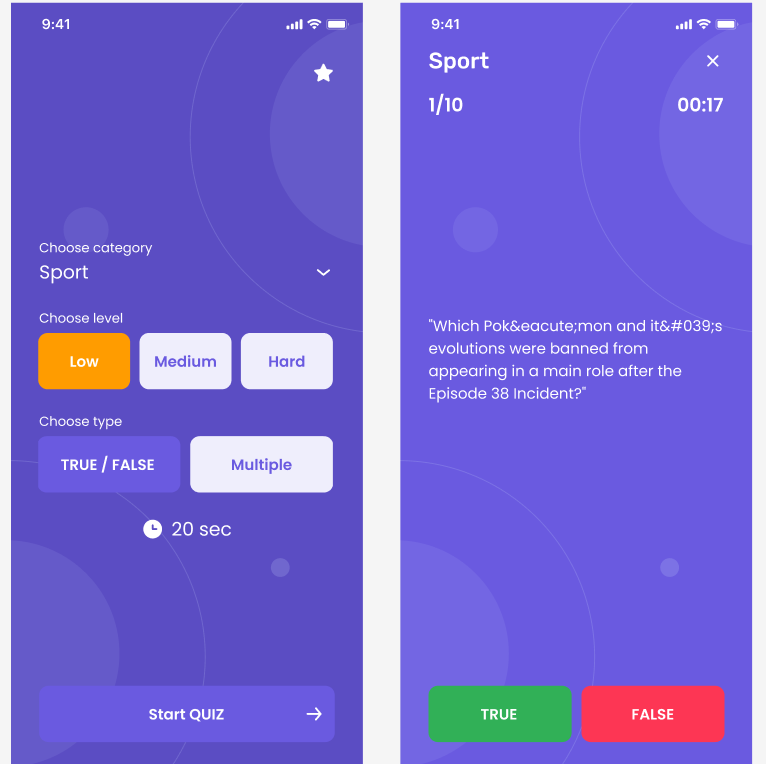

# Quizy

Quizy is a mobile application developed using React Native.

## Version

Project Version: 0.0.1

## Instructions

Primary commands:

- To run the application for Android: `npm run android`
- To run the application for iOS: `npm run ios`
- To lint the code and find errors: `npm run lint`
- To start the application: `npm start`
- For running tests: `npm test`

## Requirements

Requirements for the project to work:

- Node.js and npm: `>=16`

## Dependencies

Key dependencies:

- [React Navigation](https://reactnavigation.org/)
- [Redux Toolkit](https://redux-toolkit.js.org/)
- [React Hook Form](https://react-hook-form.com/)
- [React Native SQLite Storage](https://github.com/andpor/react-native-sqlite-storage)

## Specifications

Main specifications used in the project:

- React: `18.2.0`
- React Native: `0.72.5`
- TypeScript: `4.8.4`
- ESLint: `8.19.0`
- Prettier: `2.4.1`
- Jest: `29.2.1`

## Additional Information

For additional information and guidance, refer to [React Native](https://reactnative.dev/) and [GitHub Issues](link-to-issues).

## License

This project is licensed under the MIT - See the [LICENSE.md](LICENSE.md) file for details.

## Figma

[Figma file to link](https://www.figma.com/file/KI6qYnJr8GoexVQpynxeNd/Quizy?type=design&node-id=1-2&mode=design&t=tbbPXUyS5apYqEml-0) file for details.

 
